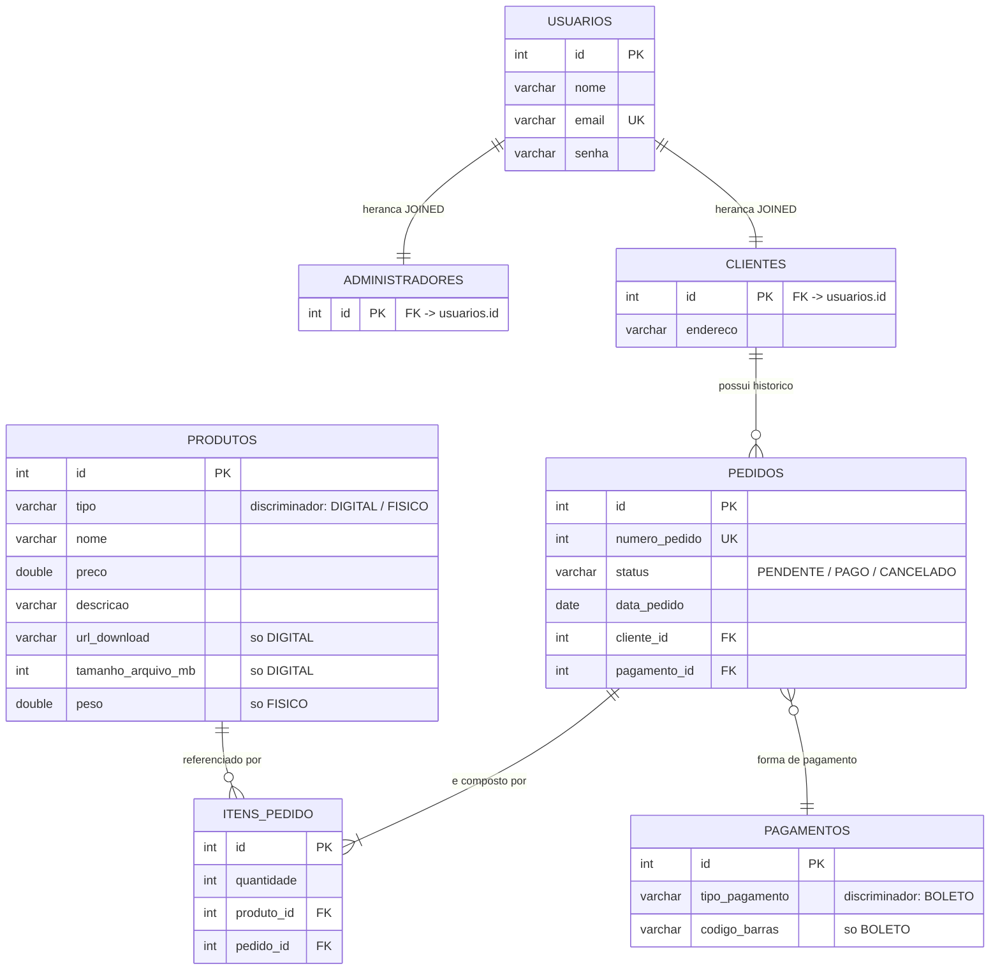

# Mapeamento Banco de Dados — Exercício Loja Online

Este documento descreve **como as classes Java são mapeadas para o banco MySQL**
usando JPA (Jakarta Persistence) + Hibernate.

> **Regra do projeto:** não existe nenhum script SQL neste repositório.
> O schema é criado e atualizado **integralmente pelo Hibernate** a partir das
> anotações JPA (`hibernate.hbm2ddl.auto = update` no `persistence.xml`) e
> todas as consultas são feitas com **JPQL** através dos DAOs.

---

## 1. Infraestrutura

| Item | Valor |
|---|---|
| SGBD | MySQL 8.4 em Docker (`docker-compose.yml`, container `loja-mysql`) |
| Banco | `loja_online` (criado automaticamente pelo container) |
| Conexão | `jdbc:mysql://localhost:3306/loja_online` (usuário `root` / senha `root`) |
| Persistence-unit | `loja` (`src/main/resources/META-INF/persistence.xml`) |
| Provedor | `org.hibernate.jpa.HibernatePersistenceProvider` |
| Geração de schema | `hibernate.hbm2ddl.auto = update` (Hibernate cria/ajusta as tabelas) |
| Transações | `RESOURCE_LOCAL` (as transações são controladas nos DAOs) |

---

## 2. Diagrama Entidade-Relacionamento



---

## 3. Classe → Tabela

| Classe Java | Anotação | Tabela | Estratégia de herança |
|---|---|---|---|
| `Entities.Usuario` | `@Entity` + `@Table(name="usuarios")` | `usuarios` | — (raiz) |
| `Entities.Administrador` | `@Entity` + `@Table(name="administradores")` + `@PrimaryKeyJoinColumn(name="id")` | `administradores` | **JOINED** |
| `Entities.Cliente` | `@Entity` + `@Table(name="clientes")` + `@PrimaryKeyJoinColumn(name="id")` | `clientes` | **JOINED** |
| `Entities.Interfaces.Produto` (abstrata) | `@Entity` + `@Table(name="produtos")` + `@DiscriminatorColumn(name="tipo")` | `produtos` | **SINGLE_TABLE** |
| `Entities.ProdutoDigital` | `@DiscriminatorValue("DIGITAL")` | `produtos` (mesma tabela) | SINGLE_TABLE |
| `Entities.ProdutoFisico` | `@DiscriminatorValue("FISICO")` | `produtos` (mesma tabela) | SINGLE_TABLE |
| `Entities.Pedido` | `@Entity` + `@Table(name="pedidos")` | `pedidos` | — |
| `Entities.ItemPedido` | `@Entity` + `@Table(name="itens_pedido")` | `itens_pedido` | — |
| `Entities.Interfaces.Pagamento` (abstrata) | `@Entity` + `@Table(name="pagamentos")` + `@DiscriminatorColumn(name="tipo_pagamento")` | `pagamentos` | **SINGLE_TABLE** |
| `Entities.Boleto` | `@DiscriminatorValue("BOLETO")` | `pagamentos` (mesma tabela) | SINGLE_TABLE |

### Por que cada estratégia?

- **JOINED em `Usuario`**: `Administrador` e `Cliente` têm campos próprios
  (`endereço` só existe em `Cliente`). Cada subclasse ganha sua própria tabela,
  ligada à `usuarios` pela mesma chave primária — sem colunas nulas.
- **SINGLE_TABLE em `Produto`**: as duas subclasses só acrescentam poucas
  colunas (`url_download`/`tamanho_arquivo_mb` ou `peso`), que ficam `NULL`
  nas linhas do outro tipo. Evita joins para listar o catálogo.
- **SINGLE_TABLE em `Pagamento`**: mesma lógica; hoje só existe `Boleto`
  (`codigo_barras`), mas a tabela já aceita novas estratégias
  (ex.: `CARTAO_CREDITO`) sem alterar o esquema.

---

## 4. Atributo → Coluna

### `usuarios` (+ `administradores` / `clientes`)

| Atributo | Coluna | Tipo lógico | Regra |
|---|---|---|---|
| `Usuario.id` | `id` | inteiro, PK, auto-incremento | `@Id @GeneratedValue(IDENTITY)` |
| `Usuario.nome` | `nome` | texto (120), obrigatório | `@Column(nullable=false, length=120)` |
| `Usuario.email` | `email` | texto (120), obrigatório, **único** | `@UniqueConstraint("uk_usuario_email")` |
| `Usuario.senha` | `senha` | texto (60), obrigatório | `@Column(nullable=false, length=60)` |
| `Cliente.endereco` | `endereco` | texto (200) | `@Column(length=200)` |
| `Administrador` | — | sem campos próprios | apenas PK compartilhada |

### `produtos` (herança SINGLE_TABLE)

| Atributo | Coluna | Tipo lógico | Regra |
|---|---|---|---|
| `Produto.id` | `id` | inteiro, PK, auto-incremento | `@Id @GeneratedValue(IDENTITY)` |
| *(herança)* | `tipo` | texto (20) | `@DiscriminatorColumn` — `DIGITAL` / `FISICO` |
| `Produto.nome` | `nome` | texto (150), obrigatório | |
| `Produto.preco` | `preco` | decimal, obrigatório | |
| `Produto.descricao` | `descricao` | texto (500) | |
| `ProdutoDigital.urlDownload` | `url_download` | texto (300) | só nas linhas `DIGITAL` |
| `ProdutoDigital.tamanhoArquivoMB` | `tamanho_arquivo_mb` | inteiro | só nas linhas `DIGITAL` |
| `ProdutoFisico.peso` | `peso` | decimal | só nas linhas `FISICO` |

### `pedidos`

| Atributo | Coluna | Tipo lógico | Regra |
|---|---|---|---|
| `Pedido.id` | `id` | inteiro, PK, auto-incremento | `@Id @GeneratedValue(IDENTITY)` |
| `Pedido.numeroPedido` | `numero_pedido` | inteiro, **único** | `@UniqueConstraint("uk_pedido_numero")`; valor é calculado pelo `PedidoDao` com JPQL (`max(numeroPedido) + 1`) na mesma transação do `persist` |
| `Pedido.status` | `status` | texto (20) | `@Enumerated(STRING)` → `PENDENTE` / `PAGO` / `CANCELADO` |
| `Pedido.data` | `data_pedido` | data | `LocalDate` |
| `Pedido.cliente` | `cliente_id` | inteiro, FK → `clientes.id`, obrigatória | `@ManyToOne(optional=false)` |
| `Pedido.pagamento` | `pagamento_id` | inteiro, FK → `pagamentos.id`, obrigatória | `@ManyToOne(cascade = PERSIST, MERGE)` — o pagamento é persistido junto do pedido |
| `Pedido.itens` | *(coleção)* | — | `@OneToMany(mappedBy="pedido", cascade=ALL, orphanRemoval=true)` |

### `itens_pedido`

| Atributo | Coluna | Tipo lógico | Regra |
|---|---|---|---|
| `ItemPedido.id` | `id` | inteiro, PK, auto-incremento | `@Id @GeneratedValue(IDENTITY)` |
| `ItemPedido.quantidade` | `quantidade` | inteiro, obrigatório | |
| `ItemPedido.produto` | `produto_id` | inteiro, FK → `produtos.id`, obrigatória | `@ManyToOne(EAGER)` |
| `ItemPedido.pedido` | `pedido_id` | inteiro, FK → `pedidos.id`, obrigatória | `@ManyToOne` — lado dono da relação |

### `pagamentos` (herança SINGLE_TABLE)

| Atributo | Coluna | Tipo lógico | Regra |
|---|---|---|---|
| `Pagamento.id` | `id` | inteiro, PK, auto-incremento | `@Id @GeneratedValue(IDENTITY)` |
| *(herança)* | `tipo_pagamento` | texto (20) | `@DiscriminatorColumn` — `BOLETO` |
| `Boleto.codigoBarras` | `codigo_barras` | texto (100) | só nas linhas `BOLETO` |

---

## 5. Relacionamentos e cardinalidades

| Relação | Cardinalidade | Mapeamento JPA | FK em |
|---|---|---|---|
| `Usuario` → `Administrador` | 1–1 (herança) | `@Inheritance(JOINED)` + `@PrimaryKeyJoinColumn` | `administradores.id` |
| `Usuario` → `Cliente` | 1–1 (herança) | `@Inheritance(JOINED)` + `@PrimaryKeyJoinColumn` | `clientes.id` |
| `Produto` → `ProdutoDigital` / `ProdutoFisico` | 1–1 (herança) | `@Inheritance(SINGLE_TABLE)` + `@DiscriminatorValue` | — (coluna `tipo`) |
| `Cliente` ↔ `Pedido` | 1 – N | lado *one*: `Cliente.historicoPedidos` `@OneToMany(mappedBy="cliente", EAGER)`; lado *many*: `Pedido.cliente` `@ManyToOne` | `pedidos.cliente_id` |
| `Pedido` ↔ `ItemPedido` | 1 – N | lado *one*: `Pedido.itens` `@OneToMany(mappedBy, cascade=ALL, orphanRemoval=true)`; lado *many*: `ItemPedido.pedido` `@ManyToOne` | `itens_pedido.pedido_id` |
| `ItemPedido` → `Produto` | N – 1 | `ItemPedido.produto` `@ManyToOne(optional=false, EAGER)` | `itens_pedido.produto_id` |
| `Pedido` → `Pagamento` | N – 1 | `Pedido.pagamento` `@ManyToOne(EAGER, cascade=PERSIST/MERGE)` | `pedidos.pagamento_id` |

Notas:

- **Bidirecional** em `Cliente ↔ Pedido` e `Pedido ↔ ItemPedido`: o lado com a
  chave estrangereira é o dono da relação (`@ManyToOne`), o outro usa
  `mappedBy`. O `Pedido` sincroniza a outra ponta no próprio construtor
  (`item.setPedido(this)`) e `Cliente.adicionarPedido()` faz o mesmo.
- `orphanRemoval=true` em `Pedido.itens`: apagar o pedido apaga os itens.
- `EAGER` foi escolhido nas coleções/acessos usados no terminal para evitar
  `LazyInitializationException` com o `EntityManager` já fechado; as listagens
  de pedido ainda usam `FETCH JOIN` (JPQL) para carregar tudo em uma consulta.

---

## 6. Consultas (JPQL) usadas pela aplicação

Todas estão em `src/main/java/dao/*.java` — nenhuma usa SQL nativo:

| Uso | JPQL |
|---|---|
| Listar catálogo | `select p from Produto p order by p.nome` |
| Verificar produto em uso | `select count(i) from ItemPedido i where i.produto.id = :id` |
| Autenticar usuário | `select u from Usuario u where u.email = :email and u.senha = :senha` |
| Buscar por email | `select u from Usuario u where u.email = :email` |
| Existe administrador? | `select count(a) from Administrador a` |
| Próximo nº do pedido | `select coalesce(max(p.numeroPedido), 0) + 1 from Pedido p` |
| Pedidos (completos) | `select distinct p from Pedido p left join fetch p.itens i left join fetch i.produto left join fetch p.cliente left join fetch p.pagamento order by p.numeroPedido desc` |
| Histórico do cliente | mesma consulta acima + `where p.cliente.id = :clienteId` |

---

## 7. Como executar

```bash
# 1) sobe o MySQL
docker compose up -d

# 2) compila (o Hibernate cria as tabelas na primeira execução)
mvn compile

# 3) roda a aplicação
mvn exec:java
```

Login inicial do administrador: `admin@loja.com` / `123` (cadastrado pelo seed
apenas se o banco estiver vazio).
